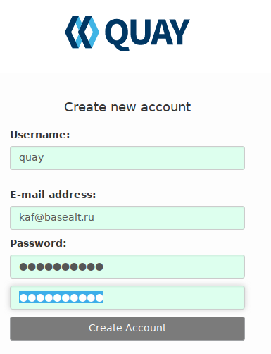

# Сборка и запуск регистратора quay

## Подключения субмодуля quay (исходный код quay)

Исходный код регистратора `quay` включен в репозиторий как субмодуль.
Для включения исходного кода после клонирования репозитория наберите команды наполнения поддиректория `dockerfiles/quayservices/quay` текущим исходным кодом:

```
$ git submodule init
Submodule 'quayservices/quay' (https://github.com/quay/quay) registered for path 'quay'
$ git submodule update
Cloning into '.../dockerfiles/quayservices/quay'...
Submodule path 'quay': checked out 'xxx...'
```

## Сборка образов quay, postgres, redis

В файле `.env` в переменной `regNS` укажите DNS-имя регистратора.
Например:
```
regNS=altlinux.io
```
DNS-имя должно быть зарегистрировано  как минимум в локальной сети на DNS-серверах.

Перейдите в каталог `dockerfiles/quayservices/` и вызовите скрипт
```
$ build.sh
```
Скрипт последовательно вызовет скрипты `build.sh` в каталогах 
`quay`, `postgres`, `redis` собирая соответсвующие образы.
В случае приведенного DNS-имени регистратора `altlinux.io` создадутся образы:
```
altlinux.io/quay/quay
altlinux.io/quay/postgres
altlinux.io/quay/redis
```

## Запуск регистратора quay через docker-compose (минимальная конфигурация)

Запуск регистратора `quay` необходимо провести на одном из узлов кластера (`master` или `worker` не важно).
Для запуска узел должен иметь не менее `6GB` оперативной памяти и не менее `20GB` дисковой.

В данном примере образы имеют префикс `altlinux.io`. Необходимо для данного домена в DNS сервере
прописать данный домен с IP-адресом узла на котором будет разворачиваться регистратор `quay`.
YML-файл [docker-compose.yml](docker-compose.yml) описания сервисов выглядит следующим образом:
```
version: '3.2'

services:
  quay:
    image: ${regNS}/quay/quay
    #command: config Htubcnhfnjh
    volumes:
      - quay_config:/quay-registry/conf/stack
      - quay_datastorage:/datastorage
    ports:
      - ${HTTPPORT}:8080
      - ${HTTPSPORT}:8443

  quayredis:
    image: ${regNS}/quay/redis
    volumes:
      - quay_redis_data:/data

  quaydb:
    image: ${regNS}/quay/postgres
    volumes:
      - quay_postgres_data:/var/lib/pgsql/data

volumes:
  quay_config:
  quay_datastorage:
  quay_redis_data:
  quay_postgres_data:
```
Переменные `regNS`, `HTTPPORT`, `HTTPSPORT` импортируются из файла `.env`:
```
regNS=altlinux.io
commitId=162b79ec
HTTPPORT=80
HTTPSPORT=443
``` 
Запуск `docker-compose.yml` скриптом `start.sh`:
```
docker-compose  -p QUAY up -d
```

При запуске создаются три сервиса:
- `quayredis` - redis-хранилище ключ-значение с именованым томом  `quay_redis_data` монтируемый в каталог `/data`;
- `quaydb` - postges-сервер с именованым томом `quay_postgres_data` монтируемый в каталог `/var/lib/pgsql/data`;
- `quay` - регистратор `quay` доступный по внешним портам `80`, `443` с именоваными томами:
  * `quay_config` монтируемый в каталог `/quay-registry/conf/stack`;
  * `quay_datastorage` монтируемый в каталог `/datastorage`.

### Конфигурация параметров сервера

Перейдите в каталог `quayservices/` и раскомментируйте в файле `docker-compose.yml` строку 
```
    command: config Htubcnhfnjh
``` 
Запустите сервисы скриптом `start.sh`.

В браузере обратитесь по URL `http://<DNS-регистратора>/` (В нашем случае `http://altlinux.io/`).
> Если порт `80` занят укажите другую привязку порта `8080` в файле `docker-compose.yml` (например `18080`) и укажите порт в URL `http://altlinux.io:18080/`  

Для авторизации укажите имя входа `quayconfig` и пароль, указанный после параметра `config` а раскомментированной строке (`Htubcnhfnjh`).

В разделе `Server configuration` укажите dns имя сервиса (например `altlinux.io`).
DNS-имя должно быть зарегистрировано  как минимум в локальной сети на DNS-серверах.


В разделе `Database` выберите тип базы `Postgres` и введите указанные значения. Укажите пароль `Htubcnhfnjh`. 

> `Database Server` берётся из имени сервиса `postgres` в `docker-compose.yml`. Значения остальных  параметров задаются в файле `postgres/Dockerfile`. 

В разделе `Redis` укажите имя сервиса `quayredis` (имя сервиса redis в `docker-compose.yml`):


После ввода минимально необходимых параметров нажмите на появившейся внизу клавише `Validate Configuration Changes`. В случае корректного ввода параметов во всплывающем окне появится надпись `Configuration Validated`: 


Нажмите на клавишу `Download` и загрузите tar-архив конфигурации на локальный компьютер (обычно в `~/Загрузки/quay-config.tar.gz`)

### Запуск quay в минимальном варианте

Остановите стек сервисов:
```
$ stop.sh
```

Под суперпользователем перейдите в каталог:
```
# cd /var/lib/docker/volumes/quay_quay_config/_data
```

Разархивируйте файл конфигурации:
```
# tar xvzf .../quay-config.tar.gz
```

Вернитесь в каталог `dockerfiles/quayservices`, закомментируйте в
`docker-compose.yml` строку 
```
    #command: config Htubcnhfnjh
``` 
и запустите сервисы скриптом `start.sh`.

### Добавление пользователей

В браузере обратитесь по URL `http://altlinux.io/`.
> Если порт `80` занят укахите другую привязку порта `8080` в файле `docker-compose.yml` (например `18080`) и укажите порт в URL `http://altlinux.io:18080/`  

Кликните клавишу `Create Account`:


Задайте необходимые параметры входа:


Кликните по клавише `Create Account`. Отобразится начальное окно интерфейса:


#### Размещение образов в репозитории

Зарегистрируйтесь в репозитории:
```
# podman login --tls-verify=false altlinux.io 
Username: quay
Password: xxxx
Login Succeeded!
```

> Если Вы планируете работать с клиентом `docker` через `docker daemon` флаг `--tls-verify=false` не используется.
> Для работы по протоколу `http` добавьте флаг `--insecure-registry altlinux.io` в файл опций `/etc/sysconfig/docker` 
> или в файл `/etc/docker/daemon.json` и перезапустите `docker daemon`.

Разместите в репозитории созданные образы:
```
# podman push --tls-verify=false altlinux.io/quay/quay 
...
Writing manifest to image destitation
Storing signatures

# podman push --tls-verify=false altlinux.io/quay/postgres 
...
Writing manifest to image destitation
Storing signatures

# podman push --tls-verify=false altlinux.io/quay/redis 
...
Writing manifest to image destitation
Storing signatures

```
Перегрузите страницу списка репозиториев:


#### Перевод размещенных репозиториев в статус `Публичные`

Последовательно зайдите в размещенные репозитории, кликните клавишу `Settings` (слева внизу)
и переведите репозитории в статус `Публичные`:


## Запуск регистратора quay в kubernetes (минимальная конфигурация)

### Предварительный настройки

#### Настройка DNS регистратора

Как описано выше, необходимо на узлах кластера прописать DNS-сервер, который по домену `altlinux.io` будет 
возвращать `IP-адрес` узла где развернут вышеописанный регистратор в режиме `docker-compose`.
После подъема регистратора в режиме `kubernetes` домен `altlinux.io` будет перепривязан  

#### Требования к узлам

На узлах, где возможен запуск образа регистратора `altlinux.io/quay/quay` (возможно с репликами) необходимо наличние не менее `6GB` оперативной памяти и `20GB` дисковой. 
На узлах, где будет запущен образ базы данных `altlinux.io/quay/postgres` необходимо наличие не менее `20GB` дисковой памяти. 
Образ `altlinux.io/quay/redis` не предъявляет особенных требований.

#### Настройка файла /etc/containers/registries.conf конфигурации регистраторов

Для работы с регистратором по локальной сети в режиме `insecure` (по протоколу `http`) в файле
`/etc/containers/registries.conf`  на всех узлах раскоментируйте описатель `[[registry]]` и добавьте нижеприведенные строки:

```
[[registry]]
location = "altlinux.io"
insecure = true
```

Кроме этого можно добавить домен `altlinux.io` в описатель `unqualified-search-registries`:
```
unqualified-search-registries = ['altlinux.io', 'docker.io', 'registry.fedoraproject.org', 'registry.access.redhat.com', 'registry.centos.org']
```

### Запуск сервисов

#### Создание namespace quay

Для удобства работы все `kubernetes-ресурсы` будут создавать в `namespace` `quay`.
Для этого необходимо создать данный `namespace`:
```
kubectl create ns quay
```

#### Создание сервиса базы данных postgres

Так как в данном развертывании не используются внешние сетевые тома, то для базы данных (как и в случае `docker-compose`) 
необходимо использовать локальный том (каталог) на одном из узлов.
В данном случае используем тома типа `hostPath`.
Опишем манифесты типа `PersistentVolume` (описание доступных томов) и PersistentVolumeClaim (запрос на том) в файле
`postgres/storage.yaml`:
```
kind: PersistentVolume
apiVersion: v1
metadata:
  name: pg-pv-volume
  labels:
    type: local
    app: postgres
spec:
  storageClassName: manual
  capacity:
    storage: 10Gi
  accessModes:
    - ReadWriteMany
  hostPath:
    path: "/var/lib/quaypostgres"
    type: DirectoryOrCreate
  nodeAffinity:
    required:
      nodeSelectorTerms:
      - matchExpressions:
        - key: kubernetes.io/hostname
          operator: In
          values:
          - worker03 
---
kind: PersistentVolumeClaim
apiVersion: v1
metadata:
  name: postgres-pv-claim
  namespace: quay
  labels:
    quay-component: postgres          
spec:
  storageClassName: manual
  accessModes:
    - ReadWriteMany
  resources:
    requests:
      storage: 10Gi
```
Манифест `PersistentVolume` описывает ресурс `pg-pv-volume` - каталог `/var/lib/quaypostgres` на узле `worker03`.
По параметрам он удовлетворяет запросу `postgres-pv-claim`.

Для инициализации необходимых пользователей и баз в файле `postgres/configmap.yaml` 
сформирован манифест `ConfigMap` с именем `postgres-config` :
```
apiVersion: v1
kind: ConfigMap
metadata:
  name: postgres-config
  namespace: quay
  labels:
    quay-component: postgres
data:
  POSTGRES_DB: registry
  POSTGRES_USER: quayuser
  POSTGRES_PASSWORD: Htubcnhfnjh
```
`ConfigMap` обеспечивает экспорт переменных `POSTGRES_DB`, `POSTGRES_USER`, `POSTGRES_PASSWORD`
в среду запускаемого контейнера. Если в сосент запуска база данных (каталог `/var/lib/quaypostgres`)
пуста, в базе данных создается указанынй пользователь и база данных. 

Манифест разворачивния `postgres` описан в файле
`postgres/deployment.yaml`:
```
apiVersion: apps/v1
kind: Deployment
metadata:
  name: postgres
  namespace: quay
  labels:
    quay-component: postgres
spec:
  replicas: 1
  selector:
    matchLabels:
      quay-component: postgres
  template:
    metadata:
      labels:
        quay-component: postgres
    spec:
      containers:
        - name: postgres
          image: altlinux.io/quay/postgres
          imagePullPolicy: "IfNotPresent"
          ports:
            - containerPort: 5432
          envFrom:
            - configMapRef:
                name: postgres-config
          volumeMounts:
            - mountPath: /var/lib/pgsql/data
              name: postgredb
      volumes:
        - name: postgredb
          persistentVolumeClaim:
            claimName: postgres-pv-claim
```
Манифест `postgres` с меткой `quay-component=postgres` запускает образ `altlinux.io/quay/postgres`
на узле `worker03` с томом, удовлетворяющий запросу `claimName=postgres-pv-claim`. Образу при запуске
будут перезаваться переменные, описанные в `configMap` с именем `postgres-config`.

Для поддержки DNS-имени `quaydb` в файле `postgres/service.yaml` описан `CliusterIP`-сервис,
привязывающий `POD` с меткой `quay-component=postgres` и портом `5432` к DNS имени `quaydb`:
```
apiVersion: v1
kind: Service
metadata:
  namespace: quay
  name: quaydb
  labels:
    quay-component: postgres
spec:
  ports:
    - port: 5432
      targetPort: 5432
  selector:
    quay-component: postgres

```


#### Создание сервиса хранилища ключ-значение redis

#### Запуск регистратора в режиме конфигурации

#### Запуск сконфигурированного регистратора


## Ссылки

- [How to manage Linux container registries](https://www.redhat.com/sysadmin/manage-container-registries)


