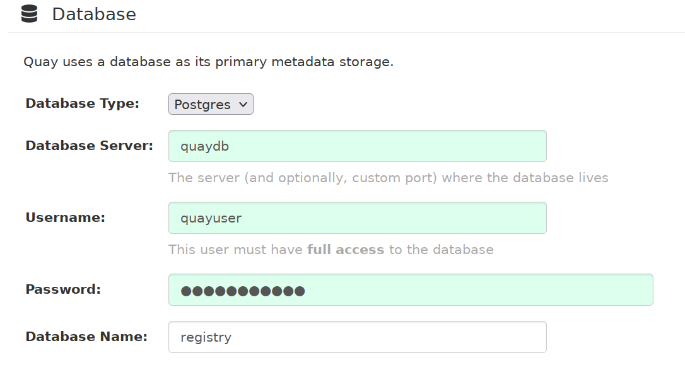

# Сборка и запуск регистратора quay

## Подключения субмодуля quay (исходный код quay)

Исходный код регистратора `quay` включен в репозиторий как субмодуль.
Для включения исходного кода после клонирования репозитория наберите команды наполнения поддиректория `dockerfiles/quayservices/quay` текущим исходным кодом:

```
$ git submodule init
Submodule 'quayservices/quay' (https://github.com/quay/quay) registered for path 'quay'
$ git submodule update
Cloning into '.../dockerfiles/quayservices/quay'...
Submodule path 'quay': checked out 'xxx...'
```

## Сборка образов quay, postgres, redis

В файле `.env` в переменной `regNS` укажите DNS-имя регистратора.
Например:
```
regNS=altlinux.io
```
DNS-имя должно быть зарегистрировано  как минимум в локальной сети на DNS-серверах.

Перейдите в каталог `dockerfiles/quayservices/` и вызовите скрипт
```
$ build.sh
```
Скрипт последовательно вызовет скрипты `build.sh` в каталогах 
`quay`, `postgres`, `redis` собирая соответсвующие образы.
В случае приведенного DNS-имени регистратора `altlinux.io` создадутся образы:
```
altlinux.io/quay/quay
altlinux.io/quay/postgres
altlinux.io/quay/redis
```


## Минимальные действия для конфигурации и запуску quay в docker-compose

### Конфигурация параметров сервера

Перейдите в каталог `quayservices/` и раскомментируйте в файле `docker-compose.yml` строку 
```
    command: config Htubcnhfnjh
``` 
Запустите сервисы скриптом `start.sh`.

В браузере обратитесь по URL `http://<DNS-регистратора>/` (В нашем случае `http://altlinux.io/`).
> Если порт `80` занят укажите другую привязку порта `8080` в файле `docker-compose.yml` (например `18080`) и укажите порт в URL `http://altlinux.io:18080/`  

Для авторизации укажите имя входа `quayconfig` и пароль, указанный после параметра `config` а раскомментированной строке (`Htubcnhfnjh`).

В разделе `Server configuration` укажите dns имя сервиса (например `altlinux.io`).
DNS-имя должно быть зарегистрировано  как минимум в локальной сети на DNS-серверах.


В разделе `Database` выберите тип базы `Postgres` и введите указанные значения. Укажите пароль `Htubcnhfnjh`. 

> `Database Server` берётся из имени сервиса `postgres` в `docker-compose.yml`. Значения остальных  параметров задаются в файле `postgres/Dockerfile`. 

В разделе `Redis` укажите имя сервиса `quayredis` (имя сервиса redis в `docker-compose.yml`):


После ввода минимально необходимых параметров нажмите на появившейся внизу клавише `Validate Configuration Changes`. В случае корректного ввода параметов во всплывающем окне появится надпись `Configuration Validated`: 


Нажмите на клавишу `Download` и загрузите tar-архив конфигурации на локальный компьютер (обычно в `~/Загрузки/quay-config.tar.gz`)

### Запуск quay в минимальном варианте

Остановите стек сервисов:
```
$ stop.sh
```

Под суперпользователем перейдите в каталог:
```
# cd /var/lib/docker/volumes/quay_quay_config/_data
```

Разархивируйте файл конфигурации:
```
# tar xvzf .../quay-config.tar.gz
```

Вернитесь в каталог `dockerfiles/quayservices`, закомментируйте в
`docker-compose.yml` строку 
```
    #command: config Htubcnhfnjh
``` 
и запустите сервисы скриптом `start.sh`.

### Добавление пользователей

В браузере обратитесь по URL `http://altlinux.io/`.
> Если порт `80` занят укахите другую привязку порта `8080` в файле `docker-compose.yml` (например `18080`) и укажите порт в URL `http://altlinux.io:18080/`  

Кликните клавишу `Create Account`:


Задайте необходимые параметры входа:


Кликните по клавише `Create Account`. Отобразится начальное окно интерфейса:


### Размещение образ в репозитории

Зарегистрируйтесь в репозитории:
```
# podman login --tls-verify=false altlinux.io 
Username: quay
Password: xxxx
Login Succeeded!
```

Разместите в репозитории созданные образы:
```
# podman push --tls-verify=false altlinux.io/quay/quay 
...
Writing manifest to image destitation
Storing signatures

# podman push --tls-verify=false altlinux.io/quay/postgres 
...
Writing manifest to image destitation
Storing signatures

# podman push --tls-verify=false altlinux.io/quay/redis 
...
Writing manifest to image destitation
Storing signatures
```
Перегрузите страницу списка репозиториев:


## Ссылки

- [How to manage Linux container registries](https://www.redhat.com/sysadmin/manage-container-registries)


